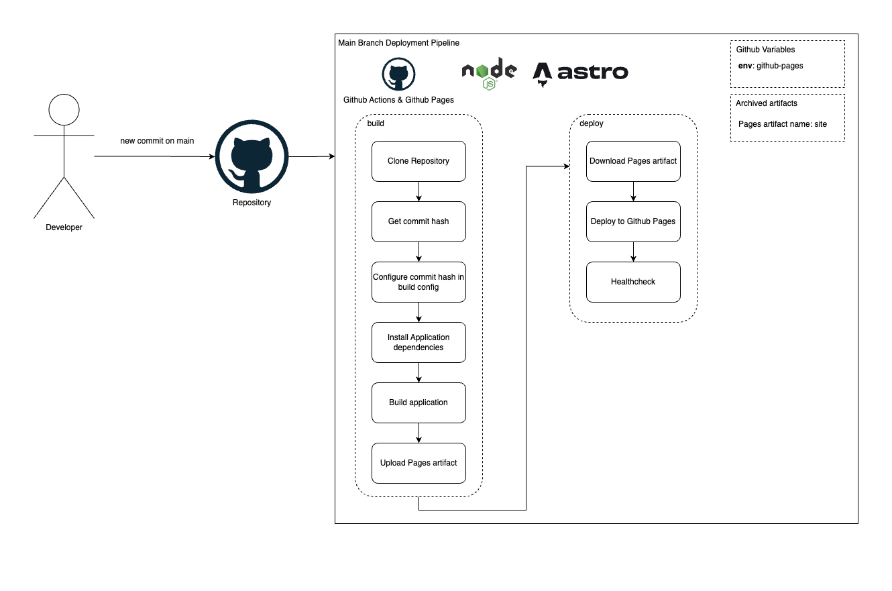
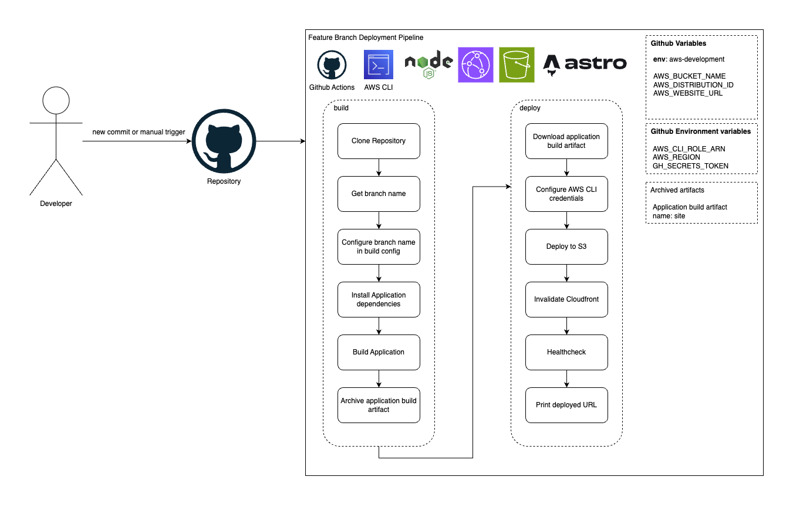

# Github Actions CI/CD Workflows

All the diagrams can be found in [planned-pipelines.drawio](./planned-pipelines.drawio).  
There are 2 environments for the application: github-pages (considered as Production) and aws-development (considered as a Development environment).  
  

## Main branch workflows
Main branch workflows are Github Actions Workflows which are executed only for the `main` branch.  

### Production (Github Pages)
This workflow builds and deploys the application to Github Pages.  
The environment is set to `github-pages` so its possible to track deployments on Github.

  

### Development (Amazon Web Services)
There are 2 workflows for the development environment & main branch: stack deploy and stack destroy workflows. They both use the `aws-development` environment.
These workflows use Amazon Web Services tooling to deploy the application: CDK, S3, CloudFront.  

The deployment workflow is only triggered when there are changes in the [cdk](../../cdk/) folder.  
The destroy workflow is triggered manually, allowed only for CODEOWNERS.  

  
  

## Feature branch workflows
Feature branches are branches which match the `^[0-9]+-.*` regex. These are typically branches created from GitHub Issues.  
There are 2 workflows: branch deployment and branch cleanup. They build the application and use the AWS CLI to deploy to S3.  
Each feature branch is deployed to a folder in S3, which has the branch's name. After a successful deployment the branch should be accessible from the `S3_URL/BRANCH_NAME` URL.  
The branch deployment workflow is triggered by every new commit to the feature branch.
The cleanup workflow is triggered on branch delete, typically after a merged pull request.

  
  
